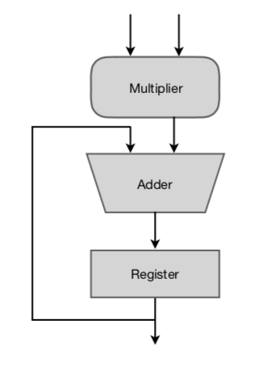

# Multiply Accumulate (MAC)

### Abstract
In computing, especially digital signal processing, the multiply–accumulate operation is a common step that computes the product of two numbers and adds that product to an accumulator. The hardware unit that performs the operation is known as a multiplier–accumulator (MAC, or MAC unit); the operation itself is also often called a MAC or a MAC operation.

    

#

#### Input Signals
* `clk` : System clock
* `rst` : Asynchronous reset
* `A` : First input
* `B` : Second input
* `N`: Number of repetitions

#### Output Signals
* `result` : Result of the MAC
