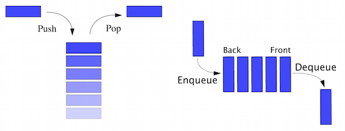

# Queue (FIFO)

### Abstract
In computer science, a queue is a collection in which the entities in the collection are kept in order and the principal (or only) operations on the collection are the addition of entities to the rear terminal position, known as enqueue, and removal of entities from the front terminal position, known as dequeue. This makes the queue a First-In-First-Out (FIFO) data structure. In a FIFO data structure, the first element added to the queue will be the first one to be removed. This is equivalent to the requirement that once a new element is added, all elements that were added before have to be removed before the new element can be removed.

    

#

#### Input Signals
* `CLK` : System clock
* `RST` : Asynchronous reset
* `EN` : Enable signal
* `In_Data` : Input data

#### Output Signals
* `Out_data` : Output data
