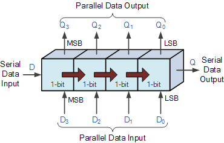

# Shift-Register

### Abstract
In digital circuits, a shift register is a cascade of flip flops, sharing the same clock, in which the output of each flip-flop is connected to the "data" input of the next flip-flop in the chain, resulting in a circuit that shifts by one position the "bit array" stored in it, "shifting in" the data present at its input and 'shifting out' the last bit in the array, at each transition of the clock input.

    

#

#### Input Signals
* `CLK` : System clock
* `RST` : Synchronous reset
* `EN` : Whenever this signal becomes `1`, shift to right operation occres.
* `LD` : Whenever this signal becomes `1`, parallel load occres.
* `Serial_In` : Serial input data
* `Par_LD` : Parallel input data

#### Output Signals
* `Serial_Out` : Serial output data
