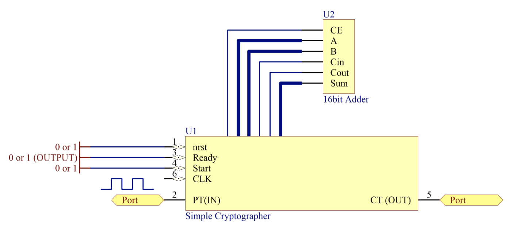

# Simple Cryptographer

### Abstract
In this project, I implemented a simple cryptographer. The main module gets a `16-bit` number and applies shift to right or summation operation on the input and repeats this loop for `K` times.

    

#

#### Input Signals
* `clk` : System clock
* `nrst` : Asynchronous reset
* `start` : Whenever this signal is `1`, the main module starts.
* `pt` : Input number

#### Output Signals
* `ct` : Output result
* `ready` : Whenever the output gets ready, this signal becomes `1`