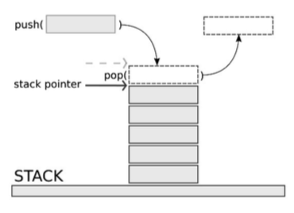

# Stack

### Abstract
Stacks in computing architectures are regions of memory where data is added or removed in a last-in-first-out (LIFO) manner.

    

#

#### Input Signals
* `clk` : System clock
* `rst` : Asynchronous reset
* `en` : Enable signal
* `push` : Push operation
* `pop` : Pop operation
* `data_in` : Input data

#### Output Signals
* `data_out` : Output data
* `sp` : Stack pointer (Point to the index of the top of the stack)
* `full` : Whenever the stack is full, this signal becomes `1`
* `empty` : Whenever the stack is empty, this signal becomes `1`
